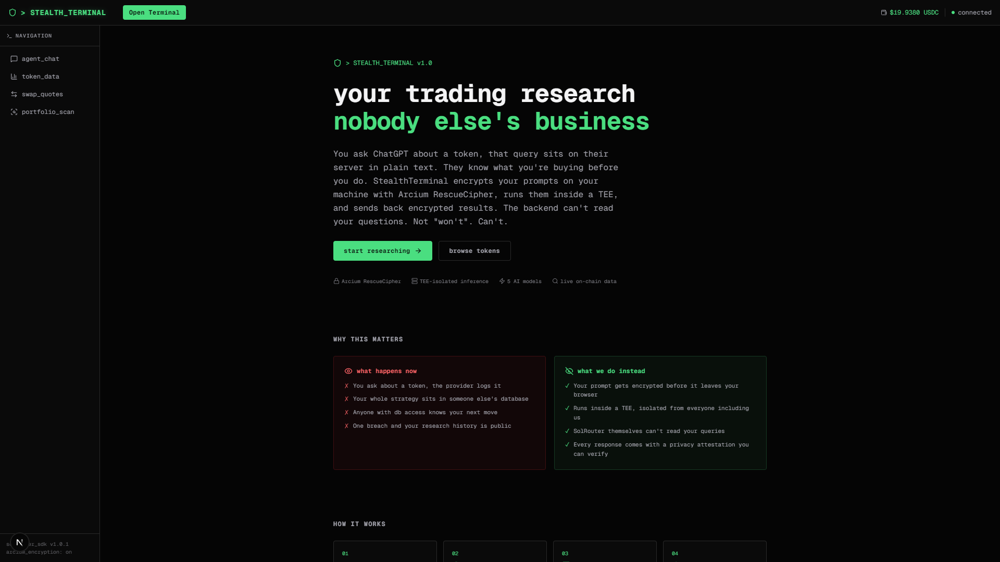
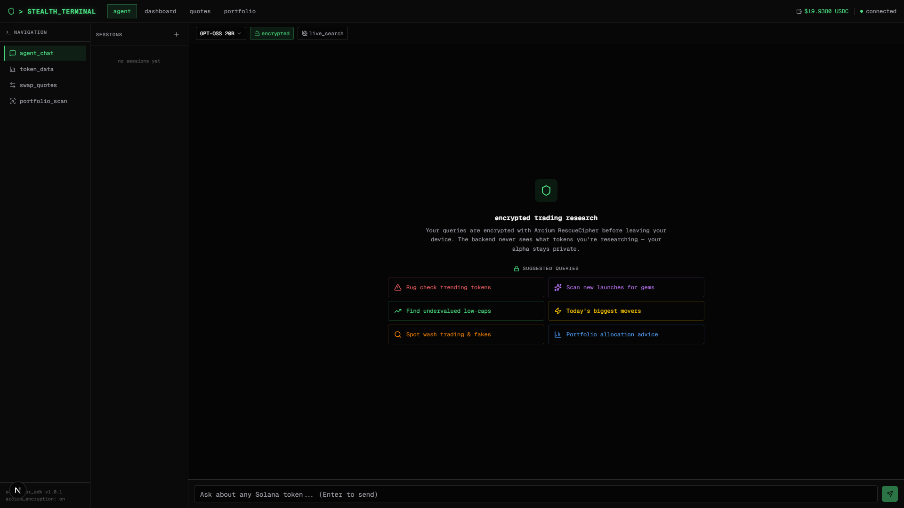
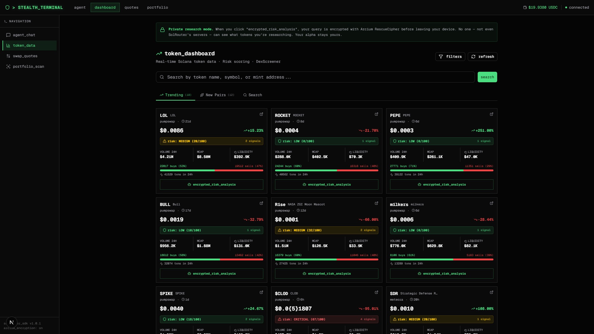
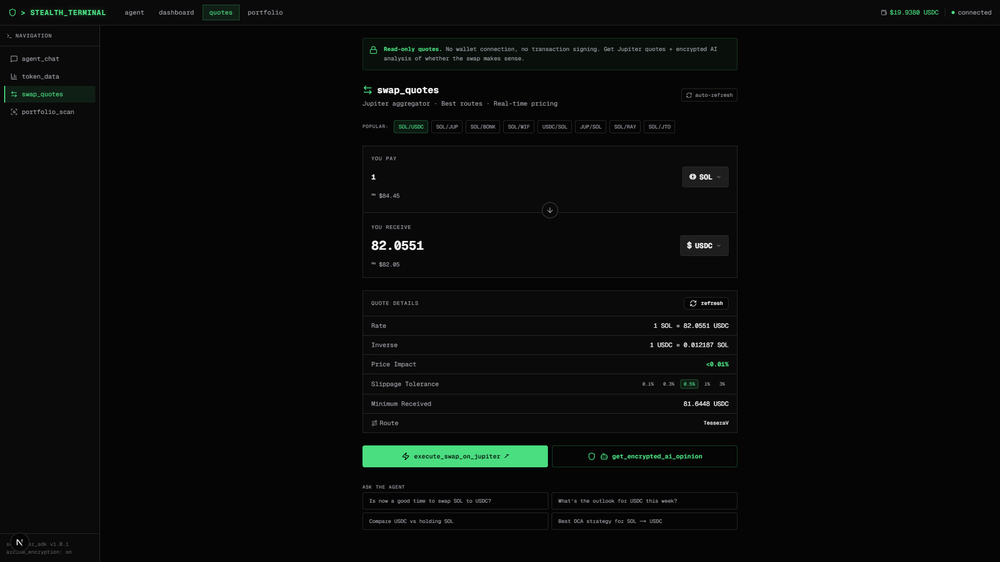
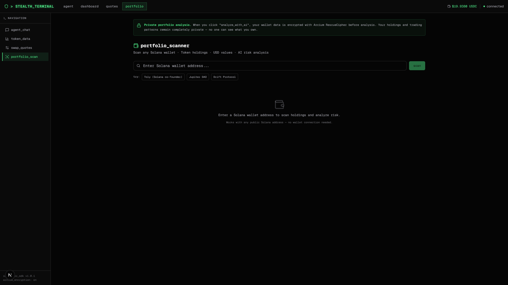
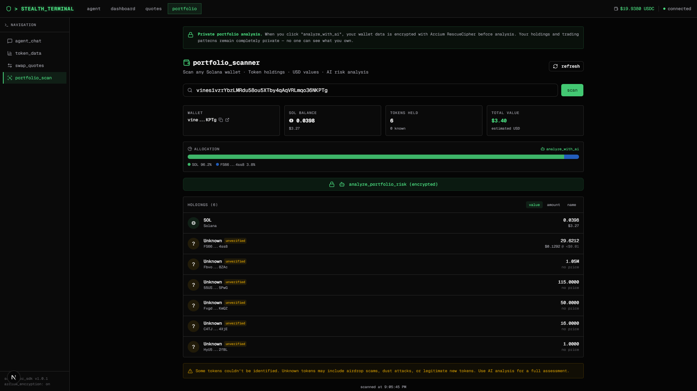

# StealthTerminal

**[Live Demo](https://private-alpha-three.vercel.app)** | [SolRouter Docs](https://solrouter.com/docs) | [@SolRouterAI](https://x.com/SolRouterAI)

Encrypted AI trading research terminal for Solana. Built on [SolRouter](https://solrouter.com) with Arcium RescueCipher encryption and TEE-isolated inference.

When you ask an AI about a token, that query normally sits on a server in plain text. The provider knows what you're looking at before you trade. StealthTerminal encrypts your prompts client-side, processes them inside a Trusted Execution Environment, and returns encrypted results. The backend can't read your questions.

## Demo

[Watch the 30s demo video](https://github.com/lilacchio/stealth-terminal/releases/download/v1.0.0/demo.mp4) | [Try it live](https://private-alpha-three.vercel.app)

https://private-alpha-three.vercel.app/demo.mp4

## Screenshots

| Landing | Agent | Dashboard |
|---------|-------|-----------|
|  |  |  |

| Quotes | Portfolio | Portfolio Scan |
|--------|-----------|----------------|
|  |  |  |

## What it does

**Encrypted AI Agent** (`/agent`)
- Chat with 5 models (GPT-OSS 20B, Qwen3 8B, Gemini Flash, Claude Sonnet, GPT-4o Mini)
- Every message encrypted with Arcium RescueCipher before it leaves your browser
- Live search pulls real-time market data without exposing your queries
- Privacy attestation ID on every response as proof of TEE processing
- Multi-session support, model/encryption settings persist across refreshes

**Token Dashboard** (`/dashboard`)
- Trending tokens and new launches from DexScreener
- Risk scoring on every token: liquidity ratios, sell pressure, token age, volume anomalies
- Filters by market cap, risk level, volume, liquidity
- "Encrypted Risk Analysis" sends token data to the AI agent for deep-dive

**Swap Quotes** (`/quotes`)
- Jupiter aggregator quotes with route breakdowns
- Price impact warnings, slippage controls (0.1% to 3%)
- USD values via DexScreener, auto-refresh every 10s
- "Get Encrypted AI Opinion" analyzes the swap privately
- Direct link to execute on Jupiter

**Portfolio Scanner** (`/portfolio`)
- Paste any Solana wallet address
- Token holdings with USD values, allocation breakdown chart
- Unknown token warnings (airdrop scams, dust attacks)
- One-click encrypted AI risk analysis of the full portfolio

## SolRouter SDK Integration

This isn't a wrapper around a chat API. Here's what we actually use:

| Feature | Implementation |
|---------|---------------|
| Encrypted inference | `SolRouter({ encrypted: true })` with Arcium RescueCipher on every call |
| TEE session management | `clearSession()` before each request to prevent shared-state conflicts |
| Multi-model routing | 5 models selectable per-query via `client.chat(prompt, { model })` |
| Live search | `useLiveSearch: true` with auto-forced encryption (required by SolRouter) |
| Privacy attestation | Attestation ID displayed on every AI response |
| Balance tracking | `getBalance()` with auto-refresh on navigation and after each query |
| Chat sessions | `chatId` for multi-turn encrypted conversations |

**Key technical decisions:**
- SDK runs server-side only (`@arcium-hq/client` needs Node.js `fs`). Client uses fetch wrappers.
- `clearSession()` is called before every request because Arcium's encryption module has shared global state (`sessionKeypair`). Without this, concurrent conversations break.
- Live search only works with `encrypted: true` on SolRouter. We detect this and force encryption when live search is toggled on.
- Retry logic handles TEE transient failures (3 attempts with 1.5s delays).

## Why private inference matters for trading

If you're researching whether BONK is about to rug, you don't want that query logged on someone's server. Front-running, data breaches, compliance risks. With StealthTerminal, the AI provider processes your query inside a TEE without ever seeing the plaintext. Your research stays yours.

This applies to every feature: token analysis, swap decisions, portfolio scanning. The encryption isn't a toggle you turn on for special occasions. It's the default.

## Tech Stack

- **Next.js 16** + TypeScript + Tailwind v4 + shadcn/ui
- **@solrouter/sdk** with Arcium RescueCipher encryption
- **@solana/web3.js** for wallet scanning (getParsedTokenAccountsByOwner)
- **Jupiter API** (`api.jup.ag/swap/v1`) for swap quotes
- **DexScreener API** for token data, prices, trending, new pairs

## Setup

```bash
git clone https://github.com/lilacchio/stealth-terminal.git
cd stealth-terminal
npm install
npm run dev
```

Open [http://localhost:3000](http://localhost:3000). You'll need a SolRouter API key to use the AI features — get one at [solrouter.com](https://solrouter.com). Token dashboard, swap quotes, and portfolio scanning work without a key.

No environment variables needed. The SolRouter API key is entered through the UI and stored in localStorage (never sent to our server, only to SolRouter's API via server-side routes).

## Project Structure

```
src/
  app/
    page.tsx              # Landing page
    agent/page.tsx        # Encrypted AI chat
    dashboard/page.tsx    # Token dashboard with risk scoring
    quotes/page.tsx       # Jupiter swap quotes
    portfolio/page.tsx    # Wallet scanner
    api/
      chat/route.ts       # SolRouter SDK (server-side)
      balance/route.ts    # Balance check
      portfolio/route.ts  # Solana RPC + DexScreener prices
      quote/route.ts      # Jupiter quote proxy
      prices/route.ts     # DexScreener price lookup
      tokens/             # DexScreener trending/search/new
  lib/
    solrouter.ts          # Client-safe SolRouter wrapper
    solana.ts             # Solana RPC helpers
    jupiter.ts            # Jupiter quote API + token data
    dexscreener.ts        # DexScreener API + risk analysis engine
    api-key-context.tsx   # API key state management
    session-context.tsx   # Chat session management
  hooks/
    useChat.ts            # Chat hook with per-call config
  components/
    header.tsx            # Nav + balance display
    chat/                 # Chat UI components
    dashboard/            # Token cards with risk badges
    ui/                   # shadcn/ui primitives
```

## Deploy

Live at **https://private-alpha-three.vercel.app**

To deploy your own:

```bash
npm run build   # verify locally
vercel           # deploy
```

No server-side secrets needed. All API keys are user-provided through the UI.

## Links

- **[Live Demo](https://private-alpha-three.vercel.app)**
- [SolRouter](https://solrouter.com) | [Docs](https://solrouter.com/docs)
- [Jupiter](https://jup.ag) | [DexScreener](https://dexscreener.com)
- [@SolRouterAI](https://x.com/SolRouterAI)
